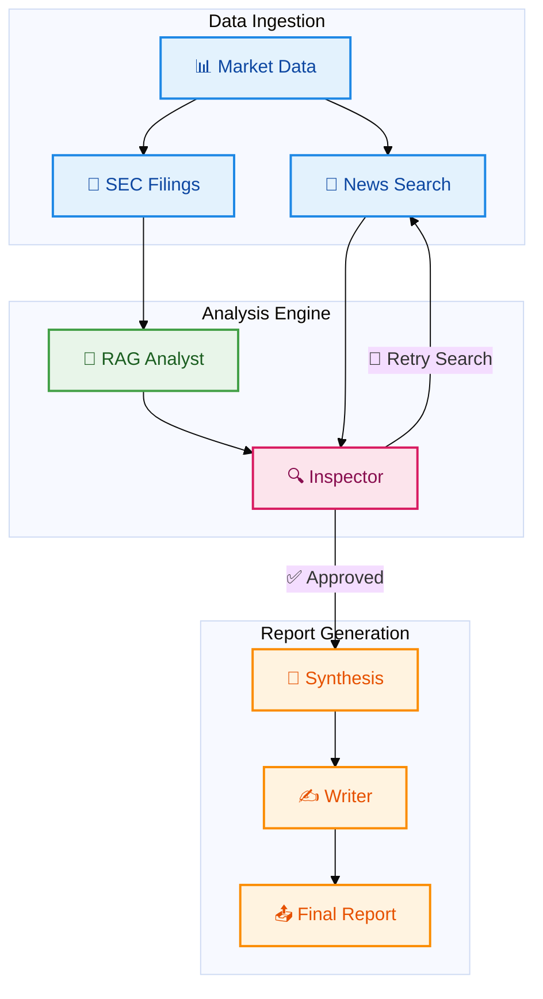

# FinSight — Autonomous Financial Research Agent

FinSight is a modular, node-based financial analysis system that automates deep company research by combining market data, real-time news, SEC filings, and retrieval-augmented generation (RAG).

It is designed to minimize hallucinations and produce structured, explainable financial insights using a pipeline of specialized nodes.

---

## Core Capabilities

- **Market Intelligence**: Fetches structured financial data using `yfinance`
- **News Context**: Retrieves recent market sentiment via Tavily
- **SEC Filing Analysis**:
  - Automatically resolves ticker → CIK
  - Fetches latest 10-K filings from EDGAR
  - Builds a FAISS vector store over filing text
- **RAG-Based Insights**:
  - Extracts risk factors
  - Extracts management guidance
  - Uses map-reduce prompting for higher accuracy
- **LLM Reasoning**: Powered by Groq-hosted models for fast inference

---

## System Architecture

The system is built as independent nodes operating over a shared `state` object.
## 🧠 FinSight Architecture



### Implemented Nodes

1. **market_data_node**
   - Fetches company metadata and financial metrics
   - Outputs: `company_name`, `sector`, `market_cap`, `financial_data`

2. **search_node**
   - Retrieves recent news and sentiment
   - Maintains retry logic via `search_attempts`
   - Outputs: `news_headlines`

3. **filing_ingestor_node**
   - Maps ticker to CIK
   - Downloads latest 10-K filing
   - Chunks and embeds text
   - Builds FAISS vector store

4. **rag_analyst_node**
   - Performs semantic retrieval over filings
   - Uses map-reduce LLM pipeline
   - Outputs:
     - `risk_factors`
     - `management_guidance`

---

## Project Structure

```
nodes/
  market_data.py
  search.py
  filing_ingestor.py
  rag_analyst.py

config.py
state.py
```

### In Progress

- `graph.py` — LangGraph orchestration
- `nodes/inspector.py` — validation layer
- `nodes/synthesis.py` — cross-source reasoning
- `nodes/writer.py` — final report generation
- `streamlit.py` — UI layer

---

## Tech Stack

- Python 3.12+
- LangChain / LangGraph
- Groq (LLM inference)
- FAISS (vector search)
- SEC EDGAR APIs
- Tavily (search)
- yfinance (market data)
- sentence-transformers (embeddings)

---

## Setup

### 1. Create Virtual Environment

```bash
python -m venv .venv
source .venv/bin/activate
```

### 2. Install Dependencies

```bash
pip install -r requirements.txt
```

### 3. Configure Environment Variables

Create a `.env` file in the root directory:

```env
GROQ_API_KEY=your_key
TAVILY_API_KEY=your_key
OPENAI_API_KEY=optional
SEC_API_KEY=optional
```

---

## Quickstart

Run the current pipeline:

```python
from nodes.market_data import market_data_node
from nodes.search import search_node
from nodes.filing_ingestor import filing_ingestor_node
from nodes.rag_analyst import rag_analyst_node

state = {"ticker": "AAPL", "search_attempts": 0}

state.update(market_data_node(state))
state.update(search_node(state))
state.update(filing_ingestor_node(state))
state.update(rag_analyst_node(state))

print(state["company_name"])
print(state["risk_factors"])
print(state["management_guidance"])
```

---

## Configuration

Defined in `config.py`:

- Models:
  - `FAST_MODEL = "llama-3.1-8b-instant"`
  - `POWERFUL_MODEL = "llama-3.3-70b-versatile"`
  - `EMBEDDING_MODEL = "all-MiniLM-L6-v2"`

- RAG Parameters:
  - `RAG_CHUNK_SIZE = 1000`
  - `RAG_CHUNK_OVERLAP = 200`
  - `RAG_TOP_K = 3`
  - `MAX_RAG_CHUNKS = 6`

---

## Known Limitations

- No orchestration layer (LangGraph not integrated yet)
- No final report synthesis
- Synchronous ingestion can be slow on large filings
- Minor state inconsistency (`managements_guidance` vs `management_guidance`)

---

## Roadmap

- [ ] Implement LangGraph orchestration
- [ ] Add validation + self-correction (inspector node)
- [ ] Build synthesis layer across data sources
- [ ] Generate structured financial reports
- [ ] Deploy Streamlit interface
- [ ] Add caching + async ingestion
- [ ] Add test coverage and error handling

---

## Vision

FinSight aims to evolve into a fully autonomous financial research system capable of:

- Multi-source reasoning
- Self-correcting analysis loops
- Institutional-grade report generation

---

Built as a high-impact systems project focused on real-world financial AI applications.
## Author
### Samik Parashar

